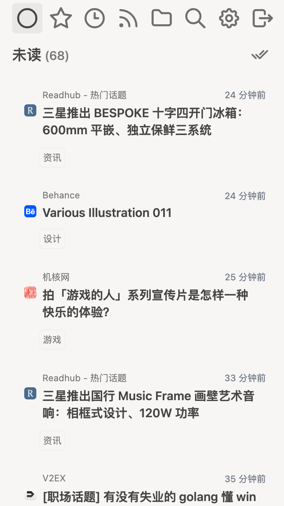
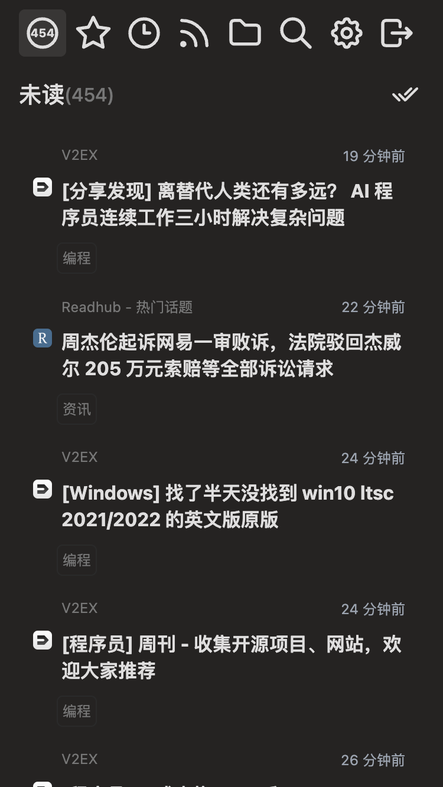
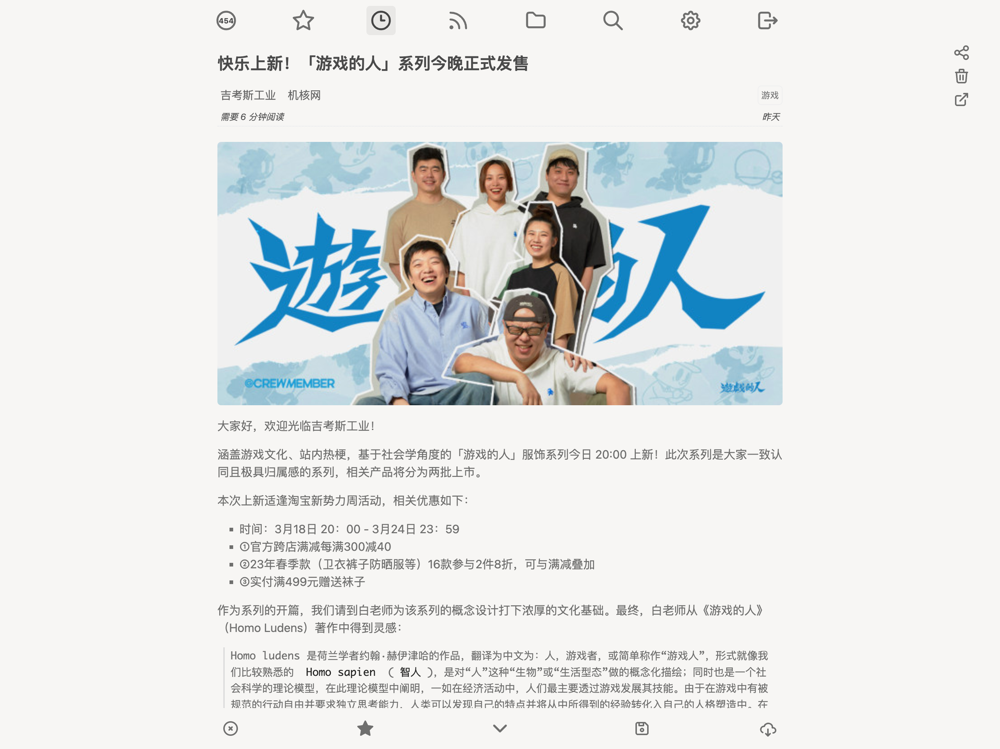

# miniflux-theme-reeder（仿 Reeder）

[Miniflux v2](https://github.com/miniflux/v2) 的自定义主题

- 使用 css 原生嵌套
- 支持自定义配置
- 基于官方 css 修改
- 移除冗余操作
- 适配移动端
- 适配 dark 暗黑模式
- 适配 Miniflux 版本：2.2.14

# 使用

复制 [style.min.css](https://github.com/rootknight/Miniflux-Theme-Reeder/blob/main/style.mini.css) 到 设置-自定义 CSS

一些建议

- 可查看 style.css 顶部进行自定义配置
- 主题选择 `System - Sans Serif` 可跟随系统切换 light/dark 模式
- 设置 `每页文章数` 为 `999999` 以隐藏 分页按钮
- 手机端使用 PWA 模式(安装到桌面使用)
  - `PWA显示模式`设置为 `独立（standalone）`
  - Android 使用 Chrome/Edge 添加至手机
  - iPhone 使用 Safari 共享添加到屏幕

# 截图

    
    
    
    

    
    

# 感谢

- [Miniflux](https://github.com/miniflux/v2)
- [Reeder](https://reederapp.com/)
- [minifier](https://www.minifier.org/)
